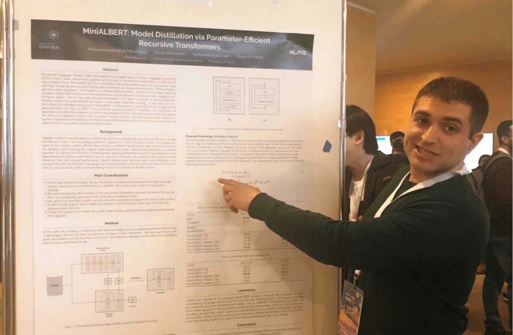

{ width=400px style="border-radius: 8px; display: block; margin-left: auto; margin-right: auto;" }

---

My name is **Omid Rohanian**. I am an Assistant Professor at the University of Copenhagen, working on natural language processing and machine learning for scientific, clinical, and social data.

Much of my research has focused on biomedical and clinical NLP: building efficient language models, adapting large language models to specialised domains, and evaluating language technologies in settings where reliability and interpretability matter. More recently, my work has expanded toward social data science, including the analysis of text, registry data, and other complex datasets for studying social and institutional systems.

I am also interested in building useful research infrastructure. I am the co-developer of [CompactBioBERT](https://huggingface.co/nlpie/compact-biobert) and have released a range of biomedical language models and resources through [NLPIE Research](https://huggingface.co/nlpie). I think of these projects not simply as model releases, but as part of a broader effort to make NLP technologies more efficient, usable, and accessible to researchers and practitioners with limited computational resources. This interest also runs through my work on knowledge distillation, compact transformer models, and domain adaptation for specialised language technologies.

You can download my CV here:  
[Download CV (PDF)](./cv.pdf)
